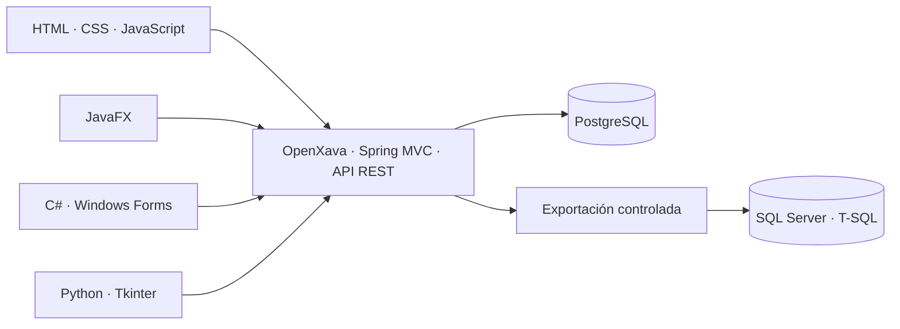

# Arquitectura de FeriaLab

## Límites del sistema

FeriaLab es un monorepo con un servidor central y clientes especializados. PostgreSQL es la fuente operativa de verdad. Los clientes no abren conexiones directas a PostgreSQL: leen y escriben a través de la API del servidor. Esto mantiene las validaciones en un solo lugar y evita repartir credenciales de base de datos.

OpenXava ofrece la administración interna del modelo JPA. La API usa endpoints Spring MVC dentro del servidor para que el resto de clientes use contratos JSON. No se depende de la generación automática de REST de XavaPro. [OpenXava documenta el uso de servicios REST personalizados con Spring MVC](https://openxava.org/OpenXavaDoc/docs/springboot_en.html), mientras su generación automática de API figura como función de XavaPro ([documentación oficial](https://openxava.org/OpenXavaDoc/docs/automatic-rest-apis_es.html)).

## Módulos y responsabilidades

### `server/`

Servidor Java 21 con Maven y OpenXava. En la primera entrega, las entidades JPA/Hibernate de convocatoria y proyecto y sus controladores REST exponen el catálogo público. Criterios, asignaciones y evaluaciones están descritos en el dominio futuro, todavía no se persisten desde la aplicación.

### `clients/web/`

Panel HTML/CSS/JavaScript para consultar y filtrar proyectos publicados. Las acciones de organización y evaluación no están disponibles todavía.

### `clients/evaluator-javafx/`

Cliente JavaFX/Maven para consultar y filtrar el catálogo de proyectos. La cola de evaluación y las puntuaciones se añadirán en una etapa posterior.

### `clients/organizer-winforms/`

Cliente C# Windows Forms dirigido a la organización para revisar y filtrar el catálogo. Usa HTTP/JSON y no conoce credenciales de PostgreSQL.

### `clients/data-tools-python/`

Herramienta Tkinter para revisar proyectos publicados y exportar el catálogo a CSV. La importación se incorporará junto con los endpoints de escritura.

### `database/sqlserver/`

Informes T-SQL para un almacén analítico opcional de SQL Server. La carga ocurre mediante un archivo de exportación documentado; los scripts no se ejecutan contra PostgreSQL.

## Modelo de dominio

- **Convocatoria:** nombre, periodo, estado, fechas y categorías admitidas.
- **Proyecto:** título, resumen, categoría, equipo, convocatoria y estado de revisión.
- **Criterio:** nombre, descripción, peso porcentual y orden dentro de una rúbrica.
- **Asignación:** relación entre un evaluador y un proyecto.
- **Evaluación:** estado y resultado de una asignación completada.
- **Puntuación:** nota y comentario de un evaluador para un criterio.

Reglas iniciales: el peso de los criterios de una rúbrica activa debe sumar 100; una nota debe quedar en el intervalo configurado; solo una asignación activa puede generar una evaluación; un proyecto publicado no expone datos privados del equipo.

## Seguridad

- Contraseñas y claves viven en variables de entorno o configuración local ignorada por Git.
- Las rutas de administración y evaluación requieren autenticación y autorización por rol.
- Los archivos CSV se validan por tamaño, codificación, encabezados y contenido antes de importar.
- El cliente web limita CORS a sus orígenes configurados y no almacena secretos permanentes.
- Los registros y fixtures del repositorio usan identidades ficticias.

## Etapas

1. Catálogo inicial: modelo y API de lectura, datos ficticios PostgreSQL y clientes web, JavaFX, WinForms y Tkinter.
2. Autenticación y edición segura de convocatorias y proyectos.
3. Rúbricas, asignaciones y ciclo de evaluación con control de roles.
4. Exportación de resultados y carga documentada a SQL Server para informes T-SQL.

La primera etapa no representa un sistema completo ni guarda calificaciones. Cada módulo se marcará listo cuando tenga implementación y guía de ejecución propias.
